vpart 1 basic commands

היכנס ל-su user, נווט לתיקיית הבית/שולחן העבודה ובצע את הפעולות הבאות:

צור 3 ספריות חדשות ו-3 קבצים חדשים באמצעות פקודה אחת.

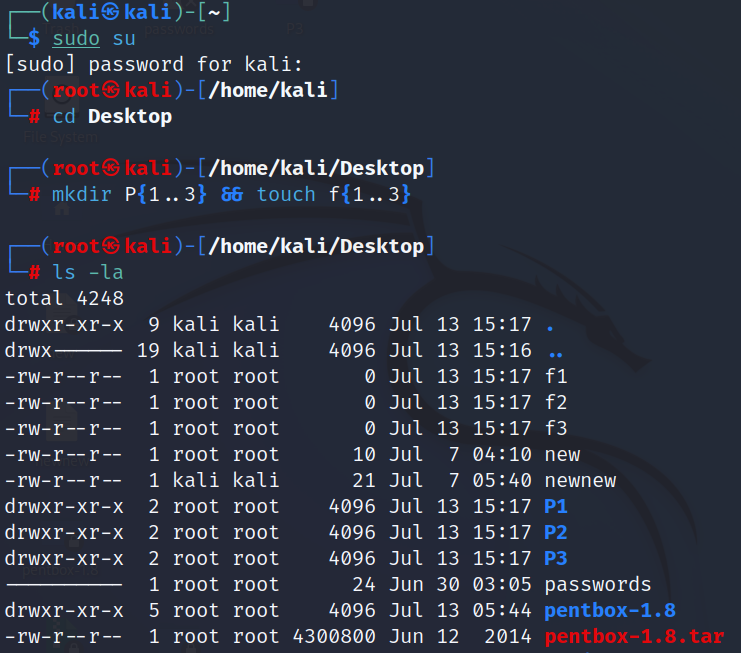

העבר את הקובץ לאחת מהספריות שיצרת.

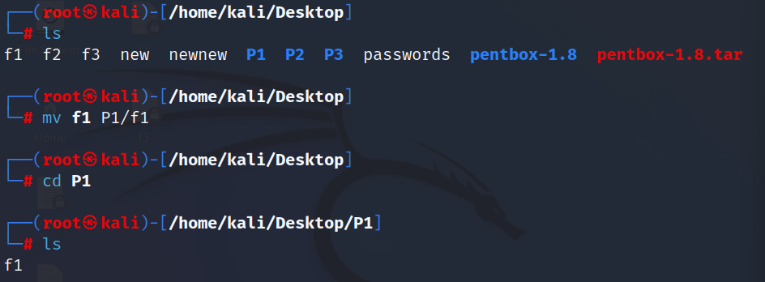

נווט אל הספרייה המכילה את הקבצים והעבר את הקבצים לספרייה אחרת.

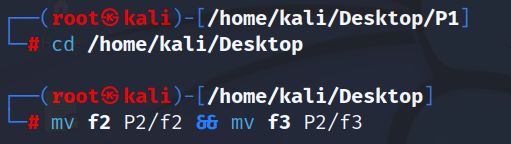

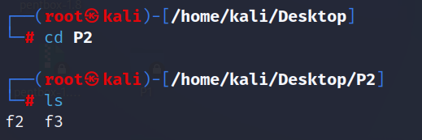

מחק את הקבצים מהספרייה.

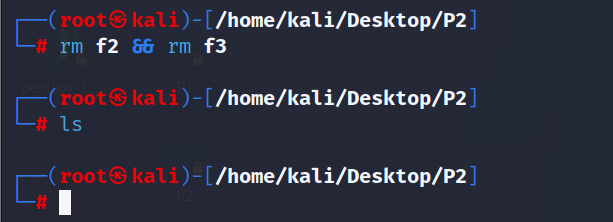

בדוק את הנתיב של הספרייה הנוכחית.

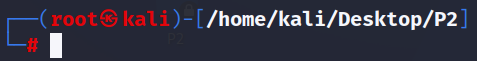

נווט אל ספריית שולחן העבודה והצג את הקבצים והתיקיות שהיא מכילה.

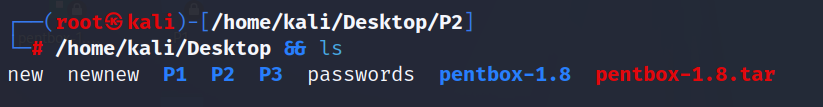

האם יש קבצים נסתרים בספרייה זו? הצג אותם.

לא קיימים קבצים נסתרים

בדוק דרך איזה משתמש אתה מחובר למערכת, בשתי דרכים

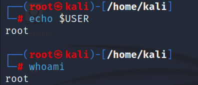

שנה את סיסמת המשתמש

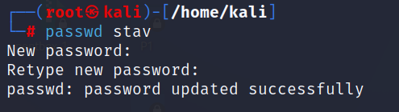

מה הפקודה CD מבצעת?

מעבר לתיקייה

מה הפקודה CD / מבצעת?

מעבר למסך הבית

בצע CD ו-CD/ ובדוק את הפלט

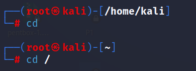

נקה את הטרמינל מהפלט

צור קובץ באמצעות NANO וכתוב את השם של מערכת ההפעלה המועדפת עליך. בנוסף, מצא דרך להציג את סוג מערכת ההפעלה הנוכחית ולהוסיף את הפלט לקובץ.

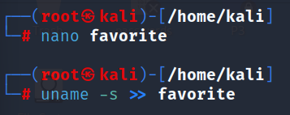

בצע פקודה שתציג את תוכן הקובץ.

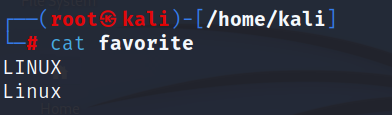

ליצור שלושה קבצים מוסתרים.

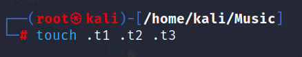

בצע פקודה שתציג את הקבצים האלה.

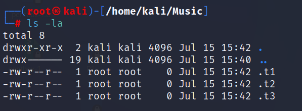

מחק את הקבצים המוסתרים שנוצרו בשלב 13.

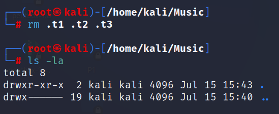

part2 search commands

צור קבצים בכל ספריית מערכת והצג את הנתיבים של קבצים אלה.

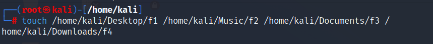

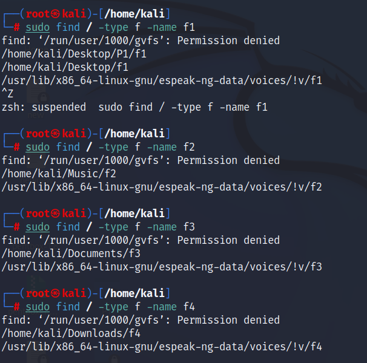

נווט אל ספריית  root והצג את כל הקבצים שמתחילים ב-3 ספרות.

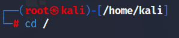

חפש את כל הקבצים במערכת שמתחילים ב-5 מספרים.

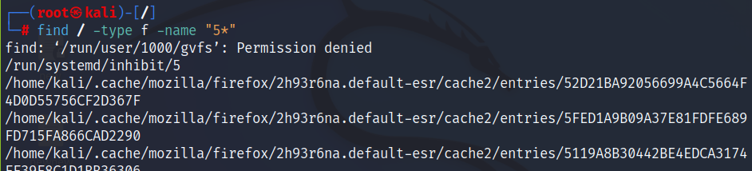

חפש את כל הקבצים במערכת שמתחיל במילה "bash".

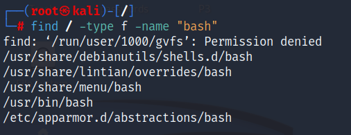

חפש את כל הספריות שקטנות מ-4MB.

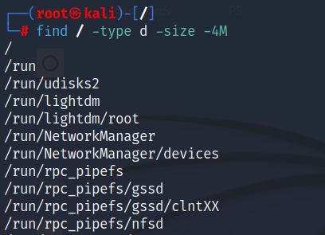

חפש את כל הקבצים שקטנים מ-3MB

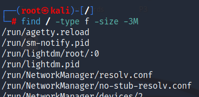

part 3 : user & group management 

צור משתמש בשתי דרכים שונות

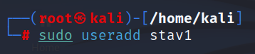

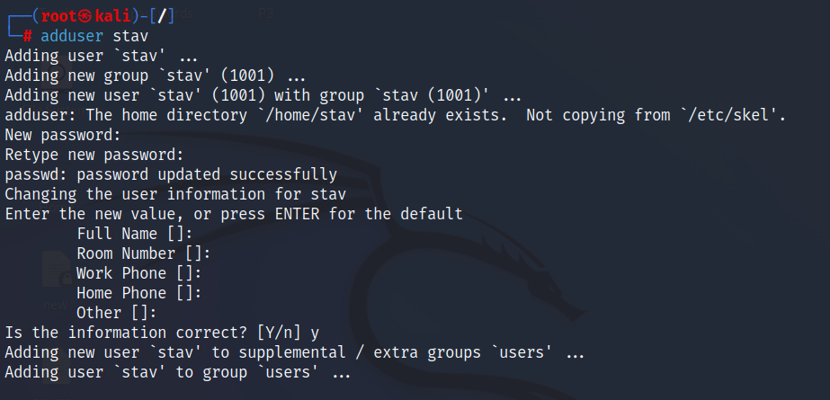

הגדר סיסמא למשתמש שיצרת

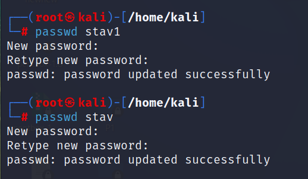

צור קבוצה חדשה

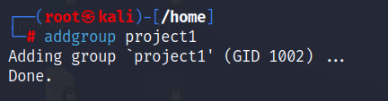

העבר את המשתמש שיצרת בסעיף 1 לקבוצה החדשה

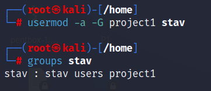

הצג את המשתמש החדש בקבוצה

מה המיקום של כל ספריות המשתמשים במערכת?

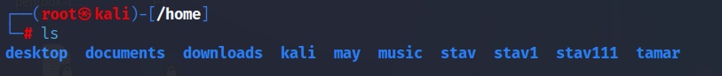

החלף למשתמש אחר

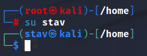

צור תיקיה עם המשתמש החדש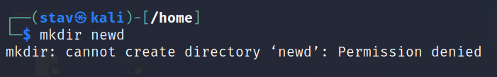

איזו פעולה עליך לבצע ליצירת תיקיה חדשה?

להפוך את המשתמש stav למנהל (root)

החלף למשתמש ROOT  , צור משתמש חדש, והוסף אותו לקבוצת , SUDOERS בפקודה אחת בלבד

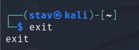

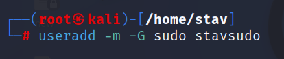

part 4 – permissions.

צור שני קבצים חדשים באחת מהתיקיות שיצרת בpart 1  ואשר רק הרשאות כתיבה לכל הקבצים באותה תיקיה

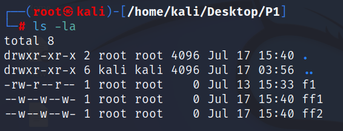

רק לקובץ אחד לבחירתך בתיקיה תן את כל ההרשאות האפשריות

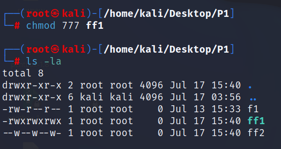

בחר קובץ אחד ושנה את הבעלים של הקובץ

part 5 ifconfig and Address settings.

בצע את הפקודה ifconfig

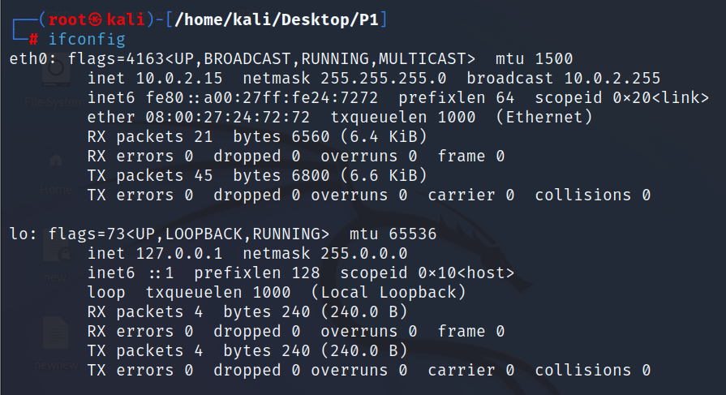

שנה את הפלט של הפקודה לאותיות גדולות

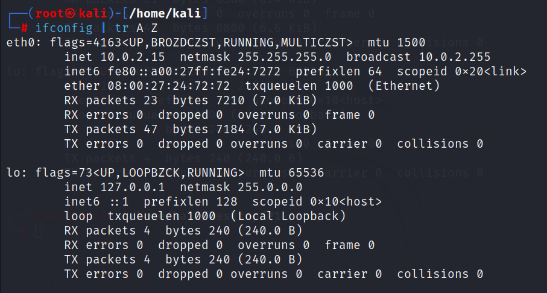

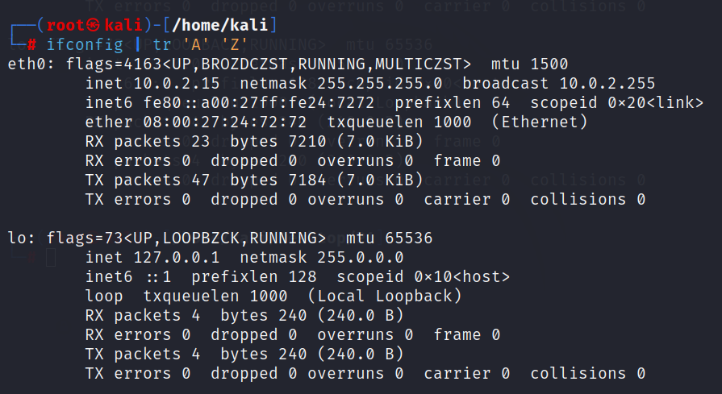

לסנן את הפקודה כדי להציג רק את ה-IP ו-SUBNET MASK

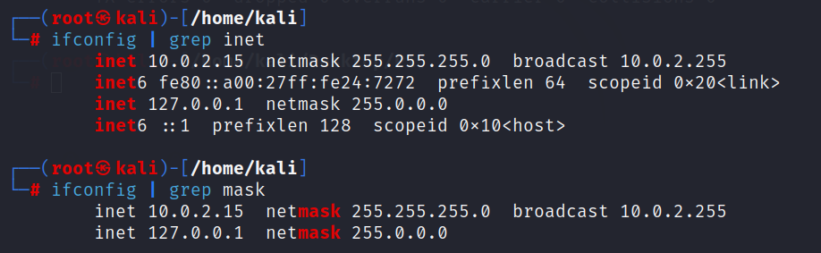

כתוב את הפלט לקובץ בשם "ip.log"

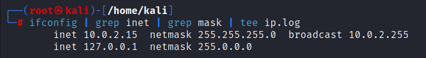

הוסף לקובץ ip.log את הדברים הבאים :whoami,last,and hostname

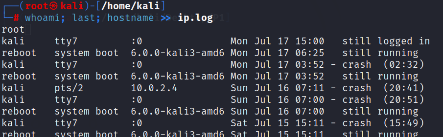

הגדר ip סטטי בטרמינל

part 6 : remote control and telnet services.

להתקין telnet במערכת ההפעלה

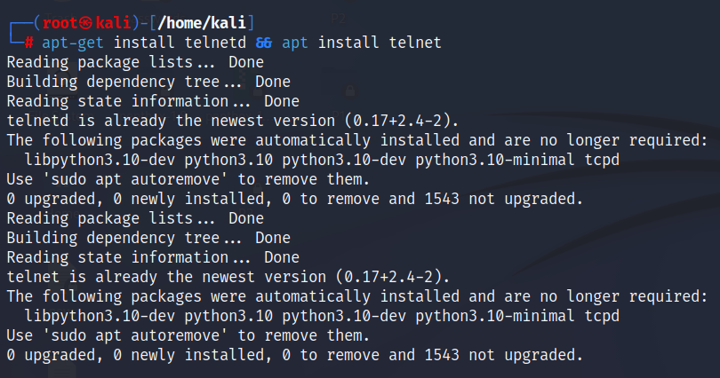

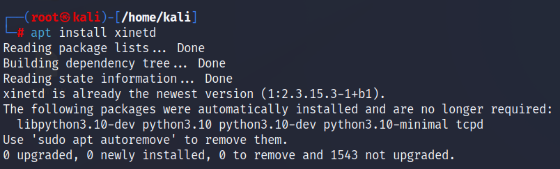

להפעיל מחדש את השירות

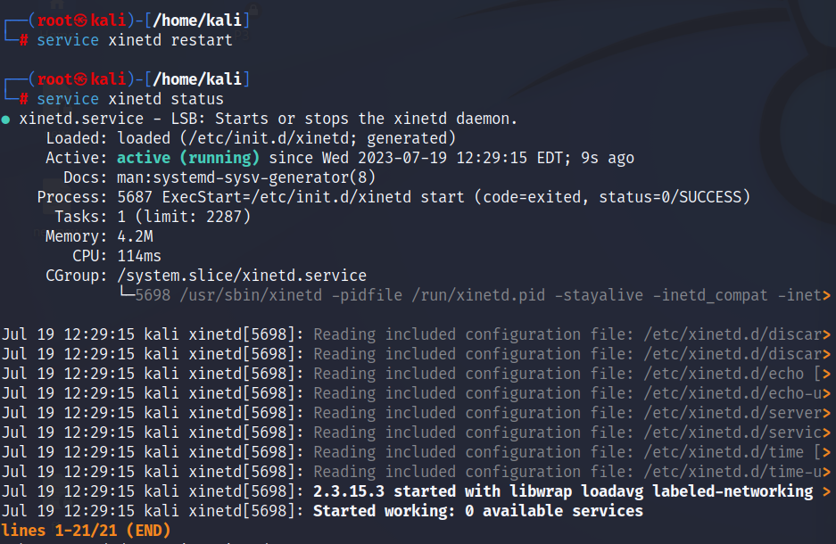

לבדוק את מצב השירות

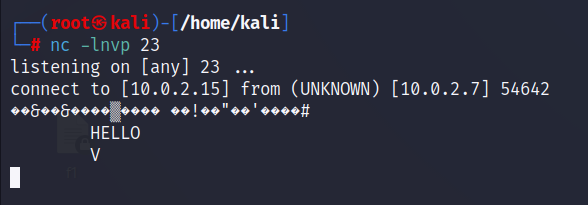

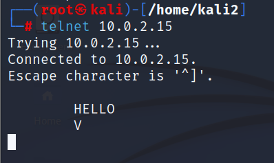

במכונת Windows, השתמש ב-PUTTY כדי להתחבר למכונת kali

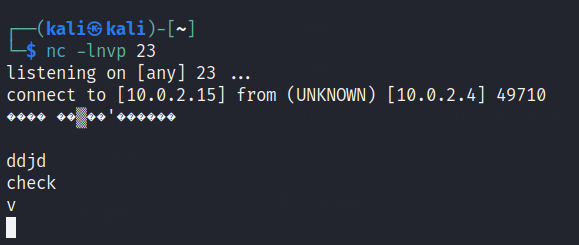

צור ספריות וקבצים כדי לוודא שהחיבור עובד

part 7 : SSH connection

הפעל את שירות SSH וודא שהשירות פועל.

להתחבר באמצעות PUTTY למכונת הלינוקס.

התחבר ל-kali linux דרך מכונת ווינדוס וצור ספרייה על Kali Desktop בשם WINDOWS_1

part 8 : vsftpd.

הורד את הגרסה האחרונה של vsftpd

הגדר את VSFTPD והפעל את השירות.

להעביר קובץ ממכונת kali למכונת WINDOWS

הפעל את wireshark והתחבר מחדש לשרת ה-FTP (מכונה Kali). נסה למצוא את הסיסמה ולהסביר מדוע הסיסמה היא בטקסט רגיל.

QUESTIONS part 9

מהן תיקיות ROOT? בחרו שלושה והסבירו עליהם

תיקייה מרכזית במערכת ההפעלה של LINUX המכילה את רוב הקבצים והתיקיות החיוניים לפעולתה של המערכת

/etc - קבצי תצורה כלל-מערכתיים ספציפיים לארח. מכיל קובצי תצורה הנדרשים על ידי כל התוכניות. זה מכיל גם סקריפטים של מעטפת הפעלה וכיבוי המשמשים להפעלה/עצירה של תוכניות בודדות.

/dev - &nbsp;קבצי מכשירים חיוניים. אלה כוללים התקני מסוף, USB או כל מכשיר המחובר למערכת.

/bin - פקודות בינאריות חיוניות שצריכות להיות זמינות במצב של משתמש יחיד. עבור כל המשתמשים, למשל, cat, ls, cp. מכיל קובצי הפעלה בינאריים.

הסבירו את המונחים הבאים:

-הַצפָּנָה – תהליך שבו מידע מומר לאלגוריתם מתמטי כדי להשתנות לטקסט לא קריא, כך שלא יהיה ניתן לקריאה ללא מפתח הצפנה. הצפנה משמשת להגנה על מידע ומבטיחה שרק מי שמכיר את המפתח הנכון יכול לקרוא את המידע המוצפן.

-האשינג - פעולת חישוב שהופכת קלט (מידע) לפלט (תוצאה) באורך קבוע.

תהליך שבו נתונים מקוריים מומרים לאלגוריתם האשינג כדי ליצור ערך קבוע באורך קבוע הנקרא "ערך חשיפה"  או "סימנטיית חשיפה". התהליך מבצע חישוב מתמטי מעל לנתונים המקוריים, והסימנטית של הנתונים עשויה להשתנות באופן חד פעמי עם כל שינוי קטן בנתונים. השימוש הרגיל באשינג הוא לבצע בדיקות אימות של נתונים בצורה מהירה ויעילה, או להגן על נתונים כדי לוודא שלא התבצעו שינויים לא רצויים בה

-הצפנה סימטרית – שיטת הצפנה בה משמשים את אותו מפתח לצורך הצפנת ופענוח מידע. זאת אומרת שהמשתמש צריך להיות ברשותו של אותו המפתח על מנת להצפין את המידע ולפענח אותו.

-הצפנה אסימטרית – שיטה בה משתמשים בשני מפתחות עקביים: מפתח ציבור ומפתח פרטי. כל משתמש במערכת מגריע בעצמו את המפתחות. המפתח הציבורי נשמר בצורה גישה לכל מי שרוצה להצפין מידע ולשלוח לבעל המפתח הפרטי. המפתח הפרטי מאוחסן באופן סודי ונשמר בצורה מאובטחת על ידי בעל המפתח.

בעת התקנת SSH, יש לשנות את קובץ התצורה:

-למה?

יש לשנות את קובץ התצורה כדי להתאים אותו לצרכים המדויקים של המערכת והאבטחה הרצויה,   על מנת שיהיה ניתן למשתמש באיזה פורט יהיה ניתן להתחבר לשרת, האם השרת יקבל סיסמאות ריקות, או אם בכלל תהיה אפשרות להתחבר באמצעות root.

-האם אתה מכיר קובץ תצורה אחר ובאיזה שירות?

בשירות ה-ftp ישנו קובץ תצורה הנקרא listen אנו משנים אותו מ-no ל-yes על מנת שנוכל להאזין.

-מהו השימוש ב-SSH?

פרוטוקול שליטה מרחוק המאפשר פעולות והעברת נתונים בצורה מאובטחת ומוצפנת בפורט 22

-האם SSH מוצפן?

פרוטוקול SSH משתמש בהצפנה כדי לאבטח את החיבור בין לקוח לרשת, כל אימות המשתמש, הפקודות, הפלט והעברת הקבצים מוצפנים כדי להגן מפני התקפות ברשת.

מה זה KARNEL?

הליבה המרכזית של מערכת ההפעלה במחשב. זהו הרכיב המרכזי שנותן למערכת היכולת לנהל ולתקשר עם החומרה ולהפעיל את יישומי התוכנה שהמשתמשים רצים.

מה צריך לבצע כדי ליצור חיבור בין שתי מכונות וירטואליות?

להסביר כל שלב.

לבדוק בכל מכונה מהי כתובת הip בעזרת הפקודה ifconfig (LINUX) ipconfig (WINDOW)

יש לכתוב בכל אחת מהמכונות ping ומיד לאחר מכן את כתובת הip של המכונה איתה נרצה לבדוק חיבור, כלומר המכונה השניה

יש לבדוק כי ישנה שליחת פקטות ממכונה למכונה, מה שאומר כי יש חיבור בין המכונות

מה זה ping?

פקודה בסיסית המאפשרת לבדוק האם יש חיבור החוצה לשרת, אתר או מחשב אחר. פקודת פינג נשלחת ממחשב אחד למחשב אחר ע"י שליחת חבילות ICMP וקבלת תגובה מהמקבל במטרה לבדוק האם המחשב זמין ואת זמן התגובה שלו

כאשר נותנים הרשאות על קבצים ותיקיות, אנו משתמשים בשלושה מספרים, מהם המספרים ומה המשמעות שלהם? מדוע אנו כותבים אותם שלוש פעמים?(777)

0 – אין הרשאות 

1 –  EXECUTE - הרשאה לביצוע, אפשרות הרצה במערכת

2 – WRITE - הרשאה לכתיבה, אפשרות כתיבה בתוך הקובץ

3 – הרשאה לכתיבה וביצוע

4 – READ - הרשאה לקריאה, מאפשרת את קריאת הקובץ

5 – הרשאה לקריאה וביצוע

6 – הרשאה לקריאה וכתיבה

7 –הרשאות מלאות

פקודות אלו נכתבות בספרות שונות כיוון שכל ספרה מהווה קבוצת משתמשים שונה.

הספרה הראשונה (משמאל לימין) מהווה את ההרשאות הניתנות לקבוצת ה"משתמשים" (USERS).

הספרה השניה מהווה את ההרשאות הניתנות לקבוצת ה"קבוצות" (GRUPS).

הספרה השלישית (הימנית) מהווה את ההרשאות הניתנות לקבוצת ה"אחרים" (OTHERS).

האם נוכל ליצור שתי תיקיות עם אותו שם, האחת באותיות קטנות והשנייה באותיות גדולות?

כן, ניתן ליצור שתי תיקיות תחת אותו שם האחת באותיות קטנות והשנייה באותיות גדולות

mkdir dir – באותיות קטנות

mkdir DIR – באותיות קטנות

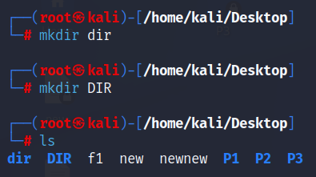